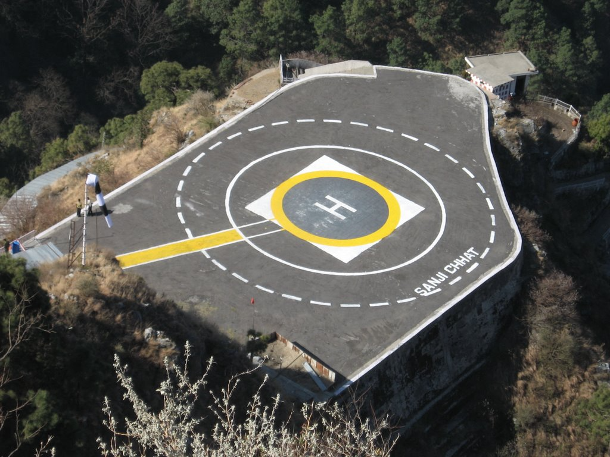
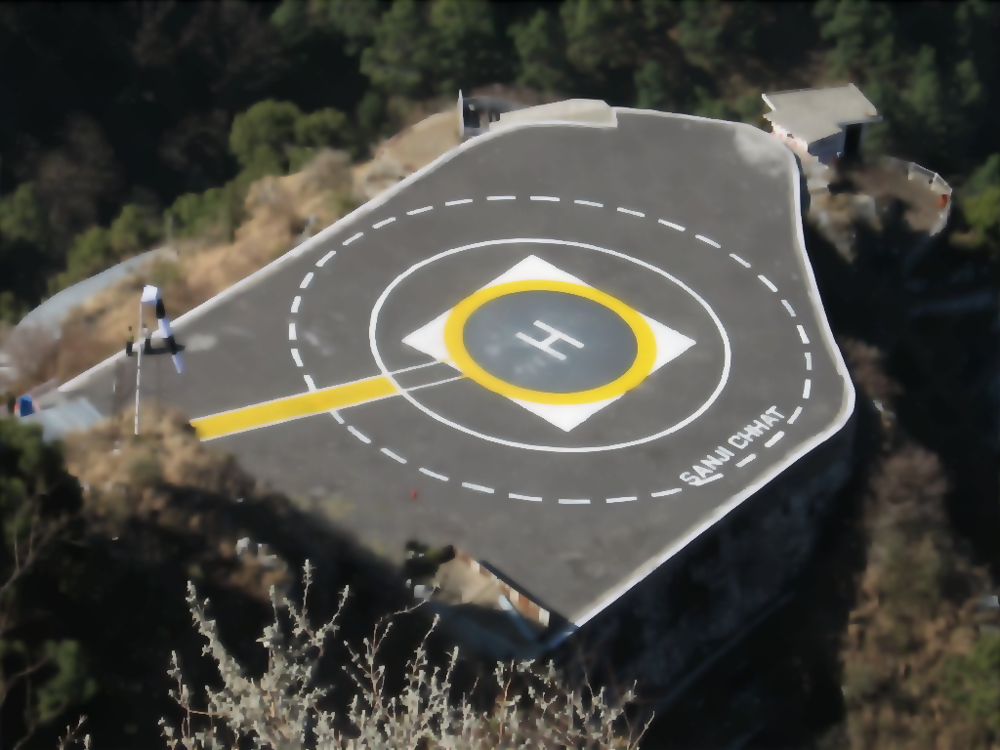

# GPU Powered Perona - Malik Anisotropic Filter

<div align=justify>

The implementation of Perona - Malik anisotropic smoothing filter on a GPU using OpenCL. The filter features a built-in edge detector and because of this is able to preserve meaningful contours during smoothing.

</div>

|  |  |
| --- | --- |
| Original | Filtered |

## Build

```
mkdir build && cd build
cmake ..
make
```

## Usage

```
./pm [-i -t -f -p -d -r -k -b -g -v] source_file.ppm destination_file.ppm
----------------------------------------------------------------
   -i <iterations>
   -t <conduction function threshold> ]
   -f <conduction function (0-quadric [wide regions over smaller ones],1-exponential [high-contrast edges over low-contrast])>
   -p <platform idx>
   -d <device idx>
   -r <run mode (0-sequential, 1-parallel {default}, 2-both )>
   -k <kernel file (default:kernel.cl)>
   -b <bitcode file>
   -g - profile
   -v - verbose

./pm [-pi -di -h]
-----------------
   -pi (shows platform list)
   -di <platform index> (shows devices list)
   -h (help)

Examples
-------
   ./pm -v -i 16 -t 30 -f 1 in.ppm out.ppm
   ./pm -g in.ppm out.ppm
   ./pm -k kernel/kernel.cl in.ppm out.ppm
   ./pm -b kernel.gpu_64.bc in.ppm out.ppm
```

## Requirements

* CMake
* OpenCL

---

## Publications

### "Employing the Perona - Malik anisotropic filter for the problem of landing site detection"

* [almaz-antey.ru](http://www.almaz-antey.ru/upload/iblock/2d0/2d0c18ca574e557dd905f2b56bbe462e.pdf)

* [elibrary.ru](https://elibrary.ru/item.asp?id=30507851)

---

## License

MIT License

See the [LICENSE.txt](LICENSE.txt) for more details.